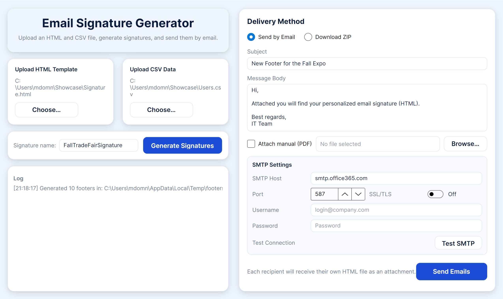

# Email Signature Generator & Sender



## Overview

This internal tool allows the team to **generate and distribute personalized email signature templates** for each employee.  
It provides an intuitive Avalonia UI to upload the HTML signature template and recipient data, generate personalized files, and either:

- **Send them directly via SMTP**, or  
- **Download all generated signatures as a ZIP archive** for manual distribution.

---

## Features

-  **HTML Template Replacement**  
  Replace placeholders in a shared HTML template (e.g., `{name}`, `{email}`, `{position}`) with actual values from a CSV file.

-  **CSV Import**  
  Load employee data such as name, email, and position from a CSV file.

-  **SMTP Email Sending**  
  Automatically send each personalized signature as a ZIP attachment using your SMTP server credentials.

-  **ZIP Export Option**  
  Generate and download all signatures into one ZIP file for local use.

-  **Optional Manual Attachment**  
  Attach an instruction PDF (e.g., “How to Install Your Signature”) to every sent email.

-  **Smart Validation**  
  Detects invalid or test email addresses and skips them automatically.

- 🖥️ **Cross-platform Avalonia UI**  
  Works on Windows, macOS, and Linux.

---

##  Requirements

- .NET 8.0 SDK or later  
- SMTP credentials (e.g., Office365, Gmail, or internal mail server)

---

##  How to Use

1. **Run the Application**
   ```bash
   dotnet run
